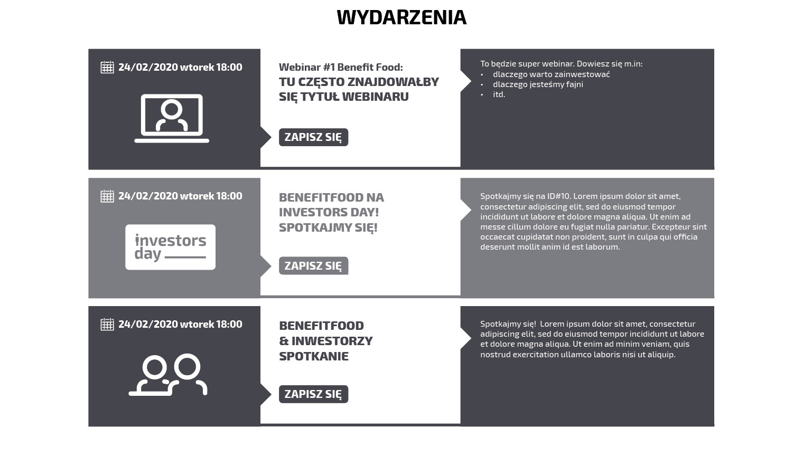

# Zadanie rekrutacyjne: Frontend Junior

Jest to zadanie próbne polegające na przygotowaniu kodu sekcji strony z wydarzeniami pobranymi z API. Dokumentacja API 
znajduje się pod adresem [https://app.swaggerhub.com/apis-docs/beesfund8/beesfund-events-api/1.0.0](https://app.swaggerhub.com/apis-docs/beesfund8/beesfund-events-api/1.0.0).
 
Technologia wykonania zadania jest dowolna - można skorzystać z czystego JS, można też użyć dowolnego frameworka 
frontendowego (np. Angular, React, Vue).

Finalnym wynikiem powinien być katalog ze stroną index.html który mozna otworzyć w przeglądarce internetowej. 
Należy przesłać zbudowaną wersję (lub instrukcję jak zbudować projekt) oraz kod źródłowy całego projektu na adres email: 
[system@beesfund.com](mailto:system@beesfund.com).

Testowy URL z danymi znajduje się pod poniższym adresem:

https://dev.bfund.ovh/api/events/1197

# Specyfikacja projektu

1. Wydarzenia wyświetlane są według dat, najpierw najwcześniejsze. Co drugie wydarzenie ma inny kolor.
2. Ikona po lewej zależy od wartości pola `type` - odpowiedni plik z katalogu `icons/` nazywa się tak jak zwracana wartość. 
3. Kliknięcie przycisku "Zapisz się" powoduje otworzenie adresu URL `registration_url` w nowym oknie.
4. Sekcja powinna wyglądać w następujący sposób:

# Co podlega ocenie?
 
1. Zgodność wyglądu sekcji z projektem na wszystkich przeglądarkach internetowych.
2. Zachowanie sekcji na urządzeniach mobilnych.
3. Formatowanie kodu oraz struktura projektu.
4. Dodatkowe punkty można uzyskać za stworzenie własnego komponentu HTML: 
https://developer.mozilla.org/en-US/docs/Web/Web_Components/Using_custom_elements
